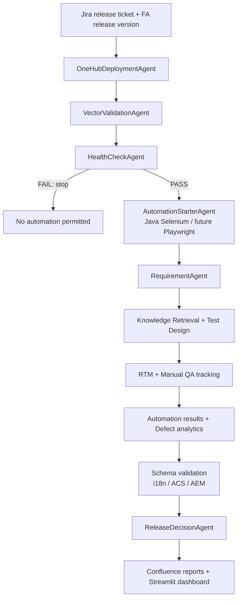

# QE AgentX Release Validation Architecture

QE AgentX assists QA engineers through the Volkswagen Feature App release process. It generates evidence and recommendations; manual execution results and release approval remain human-owned.

## Control Flow

## State and APIs

`AgentXState` carries `release_version`, `target_environment`, deployment and VECTor reports, health-check results, automation execution metadata, test artifacts, manual QA status, schema validation, and release decision data.

- `POST /pipeline/run`: accepts `story_id`, `release_version`, `target_environment`, and optional Xray export settings.
- `GET /pipeline/{run_id}/status`: exposes the current stage, health gate, HITL questions, and errors.
- `POST /pipeline/{run_id}/hitl`: accepts QA clarification. It does not execute or approve manual tests.
- `GET /artifacts/{run_id}`: returns release, health, test, coverage, schema, manual QA, and decision artifacts.

## Release Rules

- Automation starts only when all health checks pass.
- Every generated test case includes desktop Chrome, Edge, Firefox and mobile Android Chrome, iPhone Safari coverage.
- Evidence is requested as screenshots and video; QA engineers attach actual evidence and update Jira comments.
- A release decision is calculated from health, coverage, automation, blockers, and defect inputs. The recommendation is `GO`, `GO WITH RISK`, or `NO GO`; it is not an automatic release approval.

## Integration Boundaries

The current mock adapters provide deterministic behavior for demos and CI. Production adapters should implement the same agent contracts for OneHub Manager, VECTor, TA Starter, Jira, Confluence, Teams, GitHub, PostgreSQL, and ChromaDB. Credentials belong in `.env` or a managed secret store.

## Deployment

The existing Docker stack provides FastAPI, Streamlit, PostgreSQL, and Redis services. Production deployment should replace the in-memory run store and `MemorySaver` with PostgreSQL-backed persistence and configure Azure OpenAI, Jira, Confluence, OneHub, VECTor, and TA Starter credentials through the deployment secret manager.
